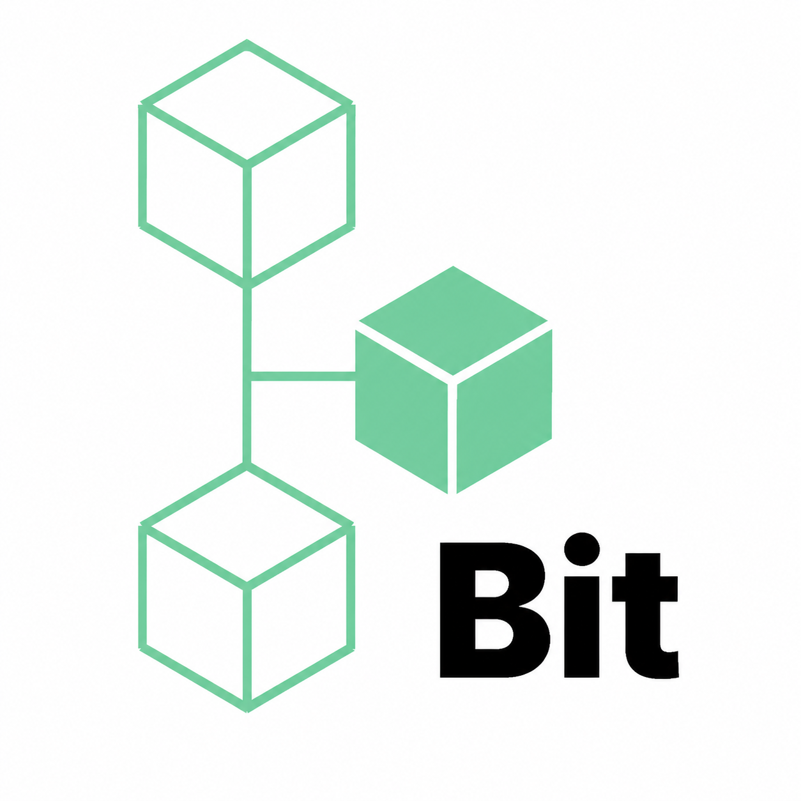
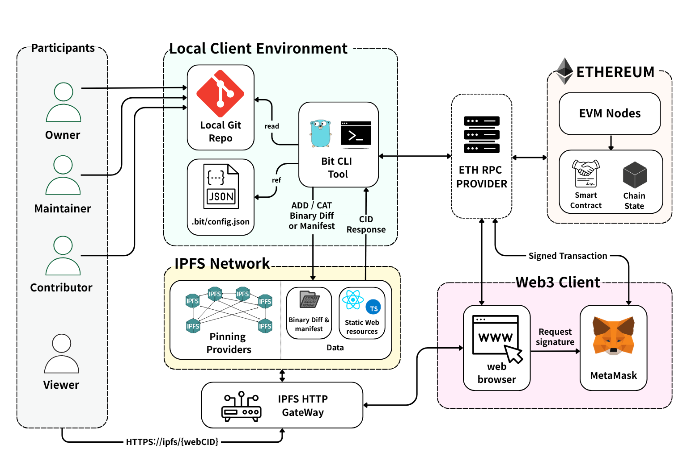
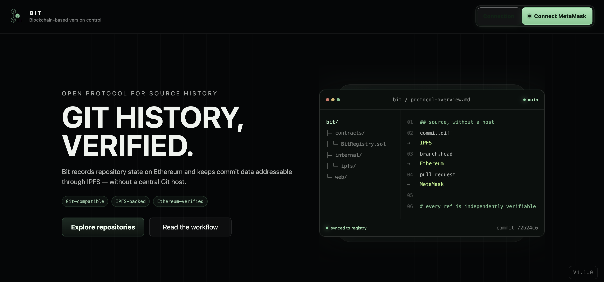
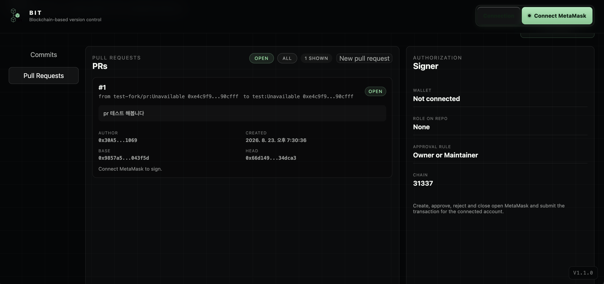

<p align="right">
  <a href="README.md">English</a> · <strong>한국어</strong>
</p>

<p align="center">
  
</p>

<h1 align="center">Bit</h1>

<p align="center">
  <strong>검증 가능한 소스 히스토리를 위한 오픈 프로토콜.</strong><br />
  Git 호환 워크플로, IPFS의 콘텐츠 주소 기반 데이터, Ethereum으로 검증하는 저장소 상태를 제공합니다.
</p>

<p align="center">
  <a href="https://github.com/opendasom/bit/actions/workflows/ci.yml"></a>
  <a href="LICENSE"></a>
  
</p>

<p align="center">
  <a href="#빠른-시작">빠른 시작</a> ·
  <a href="#데모">데모</a> ·
  <a href="https://github.com/opendasom/bit/wiki">Wiki</a> ·
  <a href="CONTRIBUTING.md">기여하기</a> ·
  <a href="SECURITY.md">보안</a>
</p>

Bit은 IPFS와 Ethereum 위에서 동작하는 실험적인 분산 버전 관리 프로토콜입니다. 커밋 Diff와 메타데이터는 IPFS에 두고, `BitRegistry`가 그에 대응하는 저장소 상태를 Ethereum에 기록합니다.

> [!WARNING]
> **Alpha 소프트웨어입니다.** 프로덕션 보안 감사를 거치지 않았습니다. 일회용 지갑과 비기밀 소스에만 사용하세요. IPFS 콘텐츠를 계속 이용하려면 Pinning 또는 복제가 필요합니다.

<hr>

## 아키텍처 🏗️

| 계층 | 역할 |
|---|---|
| **Git 클라이언트** | 로컬 저장소와 커밋을 만들고 `bit` CLI로 프로토콜 상태를 동기화합니다. |
| **IPFS** | 저장소 메타데이터, Diff, Manifest를 콘텐츠 주소 기반 객체로 저장합니다. |
| **Ethereum** | Git 커밋 해시 기반 브랜치 HEAD, Manifest·Diff CID Digest, 역할을 `BitRegistry`에 기록합니다. |
| **웹 Explorer** | 프로토콜 상태를 조회하고 MetaMask로 역할·Fork·Pull Request 작업에 서명합니다. |

<p align="center">
  
</p>

무결성 검증, 온체인 레코드, 역할, 프로토콜 제약은 [아키텍처와 데이터 모델 Wiki](https://github.com/opendasom/bit/wiki/Architecture-and-Data-Model)에서 확인할 수 있습니다.

### 웹 Explorer 🌐

배포된 [Bit Web3 Explorer](https://bitweb.space/)에서 저장소를 조회하고 레지스트리 작업에 서명할 수 있습니다.

<table>
  <tr>
    <td width="50%"></td>
    <td width="50%"></td>
  </tr>
  <tr>
    <td align="center">시작 화면</td>
    <td align="center">Pull Request 검토</td>
  </tr>
</table>

기능, 지갑 보안, 로컬 웹 설정은 [Web3 Explorer 가이드](https://github.com/opendasom/bit/wiki/Web3-Explorer)에서 확인하세요.

## 데모

<table>
  <tr>
    <td align="center" width="33%">
      <a href="https://youtu.be/f56hsj97zWA"></a><br />
      <strong>Maintainer가 저장소 생성</strong>
    </td>
    <td align="center" width="33%">
      <a href="https://youtu.be/HiM1U8WBm3g"></a><br />
      <strong>Contributor가 변경 사항 개발</strong>
    </td>
    <td align="center" width="33%">
      <a href="https://youtu.be/qIJjybwHhjo"></a><br />
      <strong>Maintainer가 Pull Request 승인</strong>
    </td>
  </tr>
</table>

<hr>

## 빠른 시작

CLI를 빌드합니다.

```bash
git clone https://github.com/opendasom/bit.git
cd bit
go build -o bit ./cmd/bit
```

로컬 환경에서 Anvil과 IPFS를 시작하고, `BitRegistry`를 배포한 다음 저장소 생성·Push·Clone 검증까지 진행하려면 [Quick Start 가이드](https://github.com/opendasom/bit/wiki/Quick-Start)를 따르세요.

## 문서 📚

| 필요한 내용 | 가이드 |
|---|---|
| 로컬 저장소 생성과 Clone 검증 | [Quick Start](https://github.com/opendasom/bit/wiki/Quick-Start) |
| 명령 문법, 설정, 자격 증명 | [CLI Reference](https://github.com/opendasom/bit/wiki/CLI-Reference) |
| 프로토콜 레코드, 검증, 역할, 제약 | [Architecture and Data Model](https://github.com/opendasom/bit/wiki/Architecture-and-Data-Model) |
| Explorer 사용과 로컬 웹 설정 | [Web3 Explorer](https://github.com/opendasom/bit/wiki/Web3-Explorer) |
| 개인정보, 지갑 보안, 취약점 제보 | [Security and Privacy](https://github.com/opendasom/bit/wiki/Security-and-Privacy) |
| 테스트, ABI 워크플로, 코드 구조 | [Development Guide](https://github.com/opendasom/bit/wiki/Development-Guide) |
| 설정과 명령 실행 문제 | [Troubleshooting](https://github.com/opendasom/bit/wiki/Troubleshooting) |

## 기여와 보안 🤝

Pull Request를 열기 전에 [CONTRIBUTING.md](CONTRIBUTING.md)를 확인하세요. 관리자가 별도로 요청하지 않는 한 모든 Pull Request는 `develop` 브랜치를 대상으로 합니다. 취약점은 공개 Issue가 아닌 [SECURITY.md](SECURITY.md)를 통해 제보하세요.

## License

이 저장소에서 작성한 Bit 소스 코드는 [MIT License](LICENSE)로 배포됩니다. 서드파티 구성 요소에는 각 구성 요소의 라이선스가 적용됩니다.
